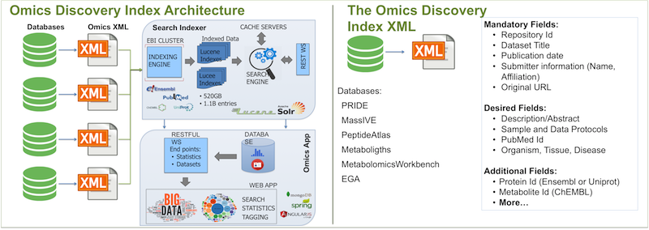

Introduction
============

.. sidebar:: Individual libraries documentation
   :subtitle: **It can make your life easier** if you want to explore individual libraries:

   - :doc:`ws`
   - :doc:`ddipy`
   - :doc:`ddiR`

Omics Discovery Index is an integrated and open source platform facilitating the access and dissemination of omics datasets. It provides a unique infrastructure to integrate datasets coming from multiple omics studies, including at present proteomics, genomics, transcriptomics and metabolomics.

OmicsDI stores metadata coming from the public datasets from every resource using an efficient indexing system, which is able to integrate different biological entities including genes, proteins and metabolites with the relevant life science literature. OmicsDI is updated daily, as new datasets get publicly available in the contributing repositories.

After the data is submitted to a formal Archive, Knowledge Base Databases (BDs) reuse part of the public data to respond to specific questions (e.g. Gene Expression Profiles - ExpressionAtlas). The number of these DBs has growth in recent years (https://www.omicsdi.org/database).

.. note:: You can read a more about the topic here: https://www.ncbi.nlm.nih.gov/pmc/articles/PMC5831141/

